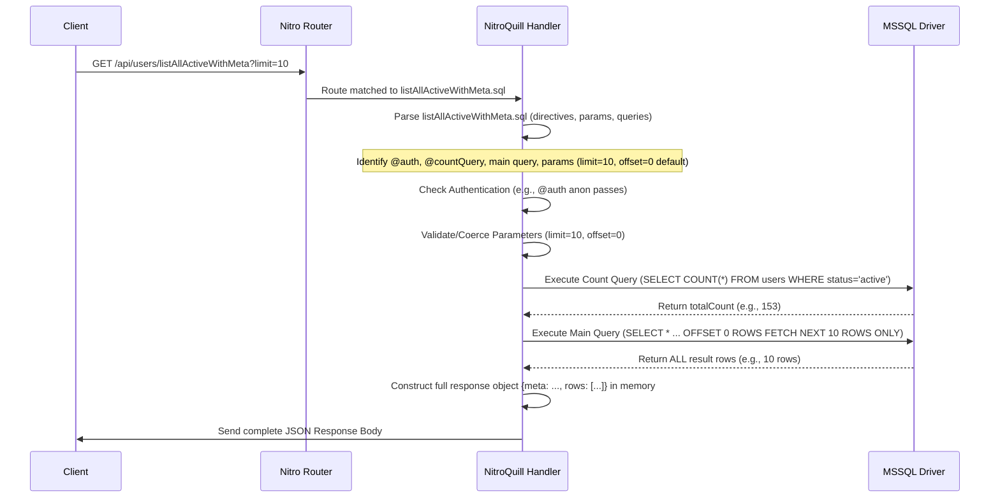
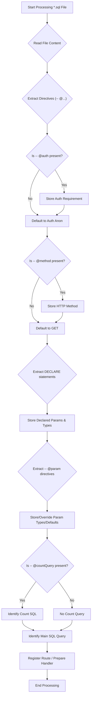

## Scope Document: `nitro-quill`

**Version:** 1.4
**Date:** 2025-04-09
**Package Name:** `nitro-quill` (Open Source Nitro Plugin)

**1. Objective**

Provide a Nitro plugin (`nitro-quill`) that automatically creates HTTP API endpoints from `.sql` files located within a designated project directory. Each `.sql` file maps to an API route based on its filename (using `camelCase`). The plugin handles request parameter binding, query execution against MSSQL, authentication, and generation of the full JSON response body.

**2. Directory Structure & Routing**

`nitro-quill` scans for `.sql` files within your Nitro project to define API routes, similar to how Nitro handles standard API routes.

* **Default Scan Directory:** By default, the plugin scans the `api/` directory at the root of your project. (This can be configured).
* **File-Based Routing:** The path and filename determine the API route. Filenames are converted to `camelCase` for the route path segments.
* **Nested Folders:** Subdirectories within the scan directory create nested API routes.

**Example Structure:**

```bash
api/
├── getOrders.sql            # -> GET /api/getOrders
├── healthCheck.sql          # -> GET /api/healthCheck
└── users/
    ├── getUserById.sql      # -> GET /api/users/getUserById
    └── listAllActive.sql    # -> GET /api/users/listAllActive
```

**3. Usage & Functionality**

Developers interact with `nitro-quill` primarily by creating `.sql` files within the scanned directory structure.

**3.1 Basic Endpoint (Inferred Parameters)**

* **File:** `api/getOrdersByStatus.sql`
* **Content:**
    ```sql
    -- Fetches orders based on status. @status is inferred as a query parameter.
    SELECT * FROM orders WHERE status = @status;
    -- Both @param and :param syntax are supported for MSSQL compatibility.
    ```
* **API Call:** `GET /api/getOrdersByStatus?status=processing`
* **Behavior:** The `@status` placeholder is detected. The `status` URL query parameter is securely bound using a prepared statement. The full result set is fetched and returned as a JSON object containing a `rows` array.

**3.2 Parameter Declaration via Directives**

* **File:** `api/getOrdersPaginated.sql`
* **Content:**
    ```sql
    -- @param limit: int = 20
    -- @param offset: int = 0
    SELECT *
    FROM orders
    ORDER BY createdAt DESC
    OFFSET @offset ROWS FETCH NEXT @limit ROWS ONLY; -- MSSQL pagination syntax
    ```
* **API Call:** `GET /api/getOrdersPaginated?limit=10&offset=20`
* **Behavior:** `limit` and `offset` are validated/coerced to `int`. Defaults are applied if query parameters are absent. The full result set is returned in the `rows` array.

**3.3 Parameter Declaration via MSSQL `DECLARE`**

* **File:** `api/products/getProductDetails.sql`
* **Content:**
    ```sql
    DECLARE @productId INT;
    DECLARE @region VARCHAR(50) = 'default'; -- Default value supported

    SELECT * FROM products WHERE productId = @productId AND salesRegion = @region;
    ```
* **API Call:** `GET /api/products/getProductDetails?productId=123&region=emea`
* **Behavior:** Parameters defined via `DECLARE` are recognized, validated, and bound. *(Note: `-- @param` directives override `DECLARE` if both exist for the same variable).*

**3.4 Zero-Parameter Endpoint**

* **File:** `api/healthCheck.sql`
* **Content:** `SELECT 1 AS Status;`
* **API Call:** `GET /api/healthCheck`
* **Behavior:** Executes the query directly and returns the result.

**3.5 Stored Procedure Execution**

* **File:** `api/admin/runUserAuditProc.sql`
* **Content:**
    ```sql
    -- @param userId: string -- Optional directive for clarity
    EXEC GetUserAuditLog @userId = @userId;
    ```
* **API Call:** `GET /api/admin/runUserAuditProc?userId=abc123`
* **Behavior:** Executes the stored procedure, passing parameters safely. Returns the full results.

**3.6 Authentication Control**

Use `-- @auth` directives for access control:

* **`-- @auth anon` (or no directive):** Public access (Default).
* **`-- @auth basic`:** Requires active user session (via host Nitro app integration).
* **`-- @auth bearer <token1>,<token2>,...`:** Requires matching `Authorization: Bearer <token>` header.

**3.7 HTTP Method Control**

Use `-- @method` directive:

* **`-- @method POST`:** Responds only to `POST`.
* **`-- @method GET`:** (Default) Responds only to `GET`.

**3.8 Handling Pagination Metadata**

To include metadata useful for pagination (like total record count) in the response, use the `-- @countQuery` directive.

* **File:** `api/users/listAllActiveWithMeta.sql`
* **Content:**
    ```sql
    -- Parameters for filtering and pagination
    -- @param status: string = 'active'
    -- @param limit: int = 25
    -- @param offset: int = 0

    -- @countQuery -- This SQL calculates the total count matching the filters
    SELECT COUNT(*)
    FROM users
    WHERE status = @status;

    -- This is the main query to fetch the paginated data slice
    SELECT userId, name, email, createdAt
    FROM users
    WHERE status = @status
    ORDER BY createdAt DESC
    OFFSET @offset ROWS FETCH NEXT @limit ROWS ONLY;
    ```
* **API Call:** `GET /api/users/listAllActiveWithMeta?status=active&limit=10&offset=20`
* **Behavior:**
    1.  The plugin executes the `@countQuery` (passing `@status`).
    2.  The plugin executes the main query (passing `@status`, `@limit`, `@offset`), collecting all rows.
    3.  The response includes a `meta` object containing `offset`, `limit`, and the `totalCount`, alongside the complete `rows` array in the JSON body. See Section 5 for response structure.

**4. Plugin Architecture & Internals (`nitro-quill`)**

* **Discovery:** Scans a configured directory (default: `api/`) for `*.sql` files during Nitro build.
* **Parsing:** For each file, extracts:
    * Main SQL body.
    * SQL body following an optional `-- @countQuery` directive.
    * Parameter placeholders (`@param`, `:param`).
    * Metadata directives (`-- @param`, `-- @auth`, `-- @method`, `-- @countQuery`).
    * Leading `DECLARE @param <type> [= default]` statements.
* **Route Registration:** Creates Nitro route handlers based on relative file paths and names.
* **Runtime Handling:**
    1.  **Auth Check:** Verifies request against the `@auth` directive.
    2.  **Parameter Handling:** Extracts, defines (via `DECLARE` or `@param`), validates, and coerces request parameters. Applies defaults.
    3.  **SQL Execution:**
        * If `-- @countQuery` is present, executes the count query using parameterized inputs. Stores the result.
        * Executes the main SQL query using parameterized inputs, **fetching all result rows into memory**.
    4.  **Response Generation:** Constructs the complete JSON response object (see Section 5) including metadata if available and the full `rows` array.
    5.  **Serialize & Send:** Serializes the complete response object to JSON and sends it to the client.
    6.  **Error Handling:** Catches DB/internal errors, logs server-side, returns sanitized HTTP errors.

**5. Technical Details & Caveats**

* **Database:** MSSQL by default. SQLite is supported via `connection: { driver: 'sqlite', filename: 'path/to/db.sqlite' }` (requires Node 22+ for the experimental `node:sqlite` module). Requires DB driver and connection configuration in the host Nitro app.
* **Security:** Relies on parameterized queries. Static bearer tokens.
* **Performance & Memory:**
    * Using `-- @countQuery` executes an **additional database query**, potentially impacting performance.
    * **The entire result set from the main query is buffered in the server's memory** before the JSON response is sent. This can lead to **high memory consumption** and potentially **out-of-memory errors** for queries returning large amounts of data. Use with caution on endpoints expected to return many rows.
* **Parameter Handling:**
    * Inferred or declared via `DECLARE` or `-- @param`. Directives override declarations.
    * Supported types: `string`, `int`, `float`, `boolean`, `date`.
* **Response Structure:**
    * **Without `-- @countQuery`:**
        ```json
        {
          "rows": [ /* complete array of row objects */ ]
        }
        ```
    * **With `-- @countQuery`:**
        ```json
        {
          "meta": {
            "offset": /* actual offset used */,
            "limit": /* actual limit used */,
            "totalCount": /* result from count query */
          },
          "rows": [ /* complete array of row objects */ ]
        }
        ```
* **Limitations (MVP):**
    * **Single Statement:** Only the first SQL statement (after `DECLARE`s) in the main query section and the `@countQuery` section is executed. Use stored procs for more complex logic.
    * **Output Format:** Fixed to `application/json`.
* **File Naming:** Uses `camelCase` for route paths.

**6. Future Considerations**

* **Response Streaming:** Re-introducing response streaming as an opt-in feature (`-- @stream`) to handle large result sets efficiently.
* `-- @output csv` directive (potentially combined with streaming).
* `-- @cache <duration>` directive.
* Role-based authorization (`-- @role <rolename>`).
* Support for multiple SQL statements or batch execution.
* Advanced input validation rules.
* Optional definition/inference of response schema.
* Development mode hot-reloading of `.sql` file changes.
* Support for environment variables in directives (e.g., `@auth bearer $API_TOKEN`).
* Allowing parameters from request body for `POST`/`PUT`.
* Optional automatic count query generation (`-- @paginationMeta`).

**7. Packaging & Distribution**

* **Package:** `nitro-quill` (NPM).
* **License:** Open Source (e.g., MIT).
* **Usage:** Installable Nitro plugin, usable in any Nitro-based project. Requires MSSQL driver (`tedious` or similar) installed by the host application.
  




## Development

Install dependencies and build the plugin:
```bash
pnpm install
pnpm run build
```

